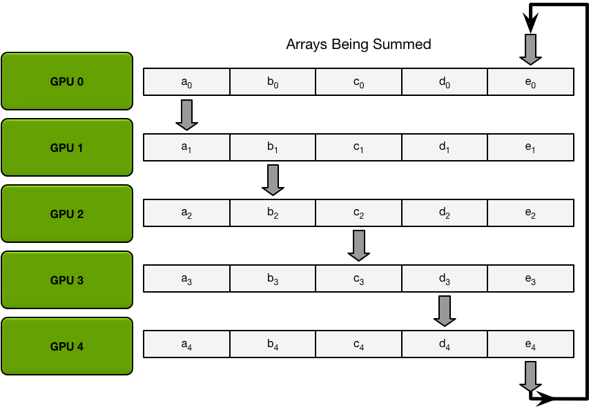
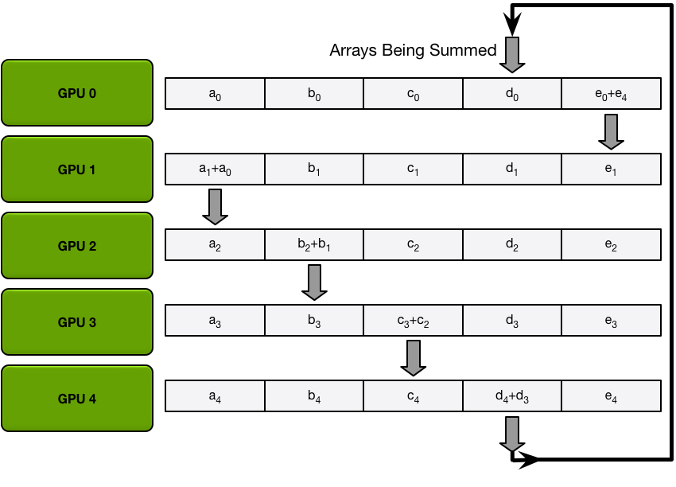
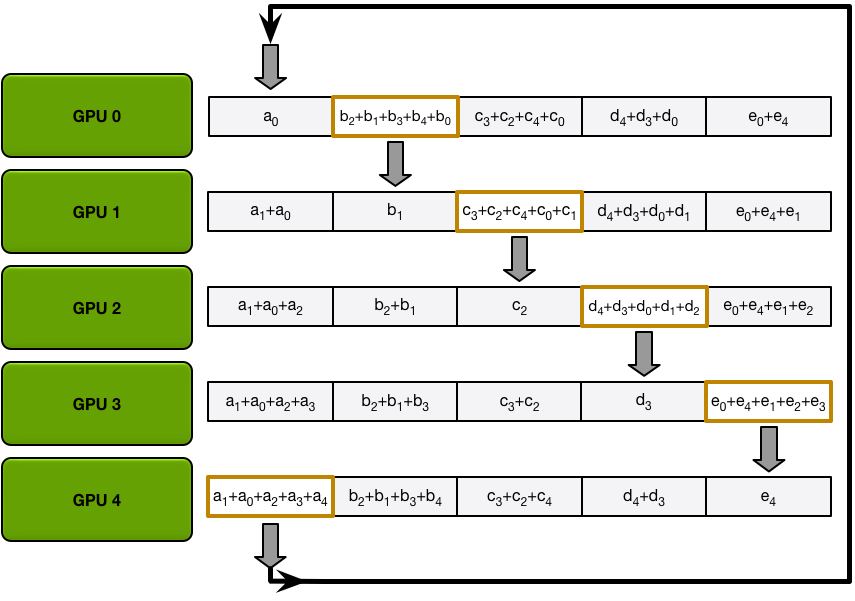
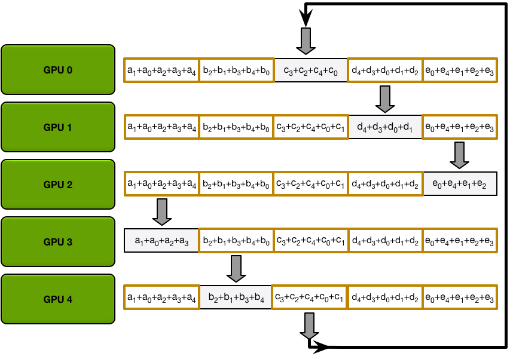

*Note:* This blog post was originally written for the Baidu Research technical blog, and is reproduced here with their permission. Since then, these ideas have evolved and been incorporated into the excellent <a href="https://github.com/uber/horovod">Horovod library by Uber</a>, which is the easiest way to use MPI or NCCL for multi-GPU or multi-node deep learning applications.

**Summary:** Neural networks have grown in scale over the past several years, and training can require a massive amount of data and computational resources. To provide the required amount of compute power, we scale models to dozens of GPUs using a technique common in high-performance computing (HPC) but underused in deep learning. This technique, the ring allreduce, reduces the amount of time spent communicating between different GPUs, allowing them to spend more of their time doing useful computation. Within Baidu’s Silicon Valley AI Lab (SVAIL), we have successfully used these techniques to train state-of-the art speech recognition models. We are excited to release our implementation of the ring allreduce as a library as well as a patch for TensorFlow, and we hope that by releasing these libraries we can enable the deep learning community to scale their models more effectively.

To learn more about the ring allreduce and why it lets us scale easily to many GPUs, read on!

---

# Introduction
Over the past several years, neural networks have proven to be an incredibly effective tool for a variety of problems, and have quickly grown in size and computational requirements. In 2012, the SuperVision convolutional network for image recognition made big gains in object recognition with two GPUs for a week and 60 million parameters<a href="#ref-1">1</a>. In 2016, researchers made breakthroughs on language modeling with a network with over a billion parameters trained on 32 GPUs for three weeks<a href="#ref-2">2</a>. Within the Silicon Valley AI Lab at Baidu Research, in 2014 the first iteration of our Deep Speech speech recognition system approximately 11 million parameters<a href="#ref-5">5</a>, while the next iteration a year later had grown to 100 million parameters<a href="#ref-3">3</a>.

As the number of parameters and computational needs of neural networks grow, efficiently parallelizing neural network training on many nodes and many GPUs becomes more and more important, because waiting months for large networks to train slows down experimentation and limits further development. In this blog post, we present a technique from the field of high-performance computing (HPC) and demonstrate how it can be applied to deep learning to achieve significant performance gains in neural network training.

# The Communication Problem

When parallelizing training of a neural network onto many GPUs, you must choose how to distribute different operations onto the different GPUs available to you. Here, we focus on a technique known as data parallel stochastic gradient descent (SGD). As in standard SGD, gradient descent is done with subsets of the data (minibatches), taking many iterations to progress through the entire dataset. In data parallel training, however, each GPU has a complete copy of the entire neural network model and for each iteration is assigned only a subset of the samples in the minibatch. For each iteration, every GPU runs forward propagation of the network on its data, followed by error backpropagation to compute the gradient of the loss with respect to the network parameters. Finally, the GPUs communicate with each other to average the gradients computed by the different GPUs, apply the averaged gradient to the weights to obtain new weights. The GPUs all progress through the iterations in lock-step, and once a GPU has completed its iteration, it must wait for all other GPUs to complete theirs so that the weights can be properly updated. This is equivalent to doing SGD on a single GPU, but we obtain a speedup by distributing the data among multiple GPUs and doing the computations in parallel.

When you only have two GPUs and parameters measured in megabytes of data, it may not matter much exactly how those GPUs communicate. However, when your models have billions of parameters, the gradients may take gigabytes of space (because there is a gradient value for every parameter), and you are coordinating dozens of GPUs, the communication mechanism becomes crucial.

For example, consider the most straight-forward communication mechanism possible. Every GPU computes a gradient on its subset of the minibatch. Then, every GPU sends its gradient to a single GPU, which takes the average of all the gradients, and sends the average back to all the other GPUs.

The more data needs to be sent, the longer it takes to send it; every communication channel has a maximum throughput (the bandwidth). For example, a good internet connection may provide a bandwidth of 15 megabytes per second, and a gigabit ethernet connection can provide a bandwidth of 125 megabytes per second. Specialized networking hardware on an HPC cluster, such as Infiniband, may provide a bandwidth of several gigabytes per second between nodes.

In the straight-forward mechanism where data is sent and received from a single GPU, that single GPU must receive all parameters from all GPUs, and send all parameters to all GPUs. The more GPUs are in the system, the greater the communication cost.

Let’s evaluate how this communication strategy works on a real model, such as a speech recognition network modeled after Baidu’s Deep Speech 2<a href="#ref-3">3</a>, with three hundred million trainable parameters. Three hundred million parameters, at four bytes per parameter, is roughly 1.2 gigabytes of data. Let’s suppose that the networking hardware on your system can support a bandwidth of one gigabyte per second; in that case, parallelizing your system onto two GPUs as described above will slow every iteration down by 1.2 seconds. Parallelizing your training onto ten GPUs will slow every iteration down by 10.8 seconds; as the number of GPUs grows, the time it takes to do every iteration grows linearly. Even if the iterations take several seconds each, this linear growth in communication cost quickly makes further parallelization impractical and kills the efficiency of your training.

One alternative is to give up on the synchronous nature of the training algorithm and remove the constraint that all GPUs progress in lock-step through the iterations of gradient descent. However, while this can make it easier to parallelize your model, algorithms that remove this constraint (variants of asynchronous SGD) can be difficult to debug and for some models can converge to subpar results, so we do not consider them for the purpose of this blog post.

Instead, we can fix the communication problem by using distributed reduction algorithms from the field of high performance computing and taking advantage of a bandwidth-optimal ring allreduce.

# The Ring Allreduce

The main issue with the simplistic communication strategy described above was that the communication cost grew linearly with the number of GPUs in the system. In contrast, a ring allreduce is an algorithm for which the communication cost is constant and independent of the number of GPUs in the system, and is determined solely by the slowest connection between GPUs in the system; in fact, if you only consider bandwidth as a factor in your communication cost (and ignore latency), the ring allreduce is an optimal communication algorithm<a href="#ref-4">4</a>. (This is a good estimate for communication cost when your model is large, and you need to send large amounts of data a small number of times.)

The GPUs in a ring allreduce are arranged in a logical ring. Each GPU should have a left neighbor and a right neighbor; it will only ever send data to its right neighbor, and receive data from its left neighbor.

The algorithm proceeds in two steps: first, a scatter-reduce, and then, an allgather. In the scatter-reduce step, the GPUs will exchange data such that every GPU ends up with a chunk of the final result. In the allgather step, the GPUs will exchange those chunks such that all GPUs end up with the complete final result.

## The Scatter-Reduce

For the sake of simplicity, let’s assume that the goal is sum up, elementwise, all elements of a single large array of floating point numbers; there are N GPUs in the system, each of the GPUs has an array of the same size, and at the end of the allreduce every GPU should have an array of the same size that contains the sum of the numbers in the original arrays.

To begin, the GPUs partition the array into N smaller chunks (where N is the number of GPUs in the ring).

Next, the GPUs will do N-1 iterations of the scatter-reduce; in every iteration, the GPU will send one of its chunks to its right neighbor, and will receive a chunk from its left neighbor and accumulate into that chunk. The chunk being sent and received by every GPU is different every iteration; the nth GPU starts by sending chunk n and receiving chunk n – 1, and then proceeds backwards from there, each iteration sending the chunk it received in the previous iteration.

For example, in the first iteration, the five GPUs in the diagram above will send and receive the following chunks:

| GPU | Send    | Receive |
|-----|---------|---------|
| 0   | Chunk 0 | Chunk 4 |
| 1   | Chunk 1 | Chunk 0 |
| 2   | Chunk 2 | Chunk 1 |
| 3   | Chunk 3 | Chunk 2 |
| 4   | Chunk 4 | Chunk 3 |

After the first send and receive is completed, each GPU will have a chunk that consists of the sum of that same chunk on two different GPUs. For example, the first chunk on the second GPU will be the sum of the values in that chunk from the second GPU and the first GPU.

In the next iterations, the process continues, and by the end, each GPU will have one chunk that contains the sum of all the values in that chunk across all the GPUs. The images below demonstrate all the data transfers and intermediate results, starting with the first iteration and continuing until the scatter-reduce is complete.

## The Allgather

After the scatter-reduce step is complete, every GPU has an array of values, and some of those values (one chunk per GPU) are the final values which include contributions from all the GPUs. In order to complete the allreduce, the GPUs must exchange those chunks, so that all GPUs have all the necessary values.

The ring allgather proceeds identically to the scatter-reduce (with N-1 iterations of sends and receives), except instead of accumulating values the GPUs receive, they simply overwrite the chunks. The nth GPU starts by sending the n+1th chunk and receiving the nth chunk, and then in future iterations always sends the chunk it has just received.

For example, in the first iteration of our five-GPU setup, the GPUs will send and receive the following chunks:

| GPU | Send    | Receive |
|-----|---------|---------|
| 0   | Chunk 1 | Chunk 0 |
| 1   | Chunk 2 | Chunk 1 |
| 2   | Chunk 3 | Chunk 2 |
| 3   | Chunk 4 | Chunk 3 |
| 4   | Chunk 0 | Chunk 4 |

After the first iteration is completed, each GPU will have two chunks of the final array.

In the next iterations, the process continues, and by the end, each GPU will have the fully accumulated values for the entire array. The images below demonstrate all the data transfers and intermediate results, starting with the first iteration and continuing until the allgather is complete.

## Allreduce Communication Cost

Recall that for the simplistic communication algorithm described in the introduction, the communication cost grew linearly with the number of GPUs. The primary reason that an allreduce works well is that this is no longer the case.

In the system we described, each of the N GPUs will send and receive values N-1 times for the scatter-reduce, and N-1 times for the allgather. Each time, the GPUs will send K / N values, where K is the total number of values in array being summed across the different GPUs. Therefore, the total amount of data transferred to and from every GPU is

$$
    \text{Data Transferred} = 2(N−1)\frac{N}{K}
$$

which, crucially, is independent of the number of GPUs.

Since all of the transfers happen synchronously in discrete iterations, the speed of the allreduce is limited by the slowest (lowest bandwidth) connection between adjacent GPUs in the ring. Given the right choice of neighbors for every GPU, this algorithm is bandwidth-optimal and is the fastest possible algorithm for doing an allreduce (assuming that latency cost is negligible compared to bandwidth)<a href="#ref-4">4</a>. In general, the algorithm functions best if all GPUs on a node are next to each other in the ring; this minimizes the amount of network contention, which could otherwise significantly reduce the effective bandwidth of the GPU-GPU connections.

## Applying the Allreduce to Deep Learning

The ring allreduce is a well-known algorithm in the field of high-performance computing, but tends to receive fairly little use within deep learning. In our lab, we’ve managed to use this tool as the basis for all our data-parallel training, allowing us to effectively scale training to dozens of GPUs.

In order to minimize communication overhead, we can exploit the structure of the neural network. In every iteration, every GPU runs forward propagation to compute errors, and then runs backward propagation to compute gradients for each of the parameters of the neural network. Backpropagation computes gradients starting from the output layer and moving towards in the put layer, which means that gradients for the output layer parameters are available significantly before gradients for the earlier layers. Since the allreduce can operate on a subset of the parameters of the network at a time, we can start the allreduce on the output layer parameters while the other gradients are still being computed. Doing so overlays the communication with the rest of the computation in the backpropagation step, and so reduces the total amount of time each GPU ends up waiting for communication to complete.

For example, consider a language model similar to the one in<a href="#ref-2">2</a>, but with approximately 300 million learnable parameters (and thus with a total gradient size of 1.2 gigabytes). Using the allreduce, each GPU must send and receive about 2.4 gigabytes of data. Using a CUDA-aware MPI implementation (such as OpenMPI), we can transfer data between GPUs using GPUDirect RDMA with a bandwidth of roughly 10 gigabytes per second; however, the connection between nodes in our cluster is slower, with Infiniband providing a bandwidth of roughly 6 gigabytes per second. Since the limiting factor is the Infiniband connections, a single iteration requires about

$$
    \frac{2.4\text{ gigabytes}}{6.0\text{ gigabytes per second}} \approx 400 \text{ milliseconds per iteration}
$$

Since layers deeper into the network have gradients available first, we can start doing the data transfers before the entire backpropagation pass is completed, so the true overhead may be less than 400 milliseconds; the overlap between communication and compute may vary depending on the nature of the neural network being optimized.

We implemented the aforementioned language model and tested the time taken per iteration as we scale from a single GPU (with no communication overhead) to 40 GPUs. These 40 GPUs are arranged into 5 nodes with 8 GPUs each, connected by Infiniband. We ran the language model for 300 iterations with a batch size of 32 and computed the number of samples processed per second.

As you can see, the throughput of the entire system scales linearly with the number of GPUs; past a certain opint, adding more GPUs does not result in a significant slowdown of each iteration. Running the model on 40 GPUs takes approximately 650 – 700 milliseconds per iteration, while on a single GPU it takes approximately 370 milliseconds. Since by our estimate communication would take 400 milliseconds, we are saving an extra 70 – 120 milliseconds per iteration by overlapping the backpropagation with the data transfer.

# Conclusion

The ring allreduce, a technique from the field of high-performance computing, allows us to efficiently average gradients in neural networks across many devices and many nodes. By using this bandwidth-optimal algorithm during training, you can drastically reduce the communication overhead and scale to many more devices, while still retaining the determinism and predictable convergence properties of synchronous stochastic gradient descent. The algorithm is network architecture and deep learning framework agnostic and can provide tangible and immediate benefits for the efficiency of data-parallel training, while also being fairly straight-forward and easy to implement.

In order to make it easier for you to take advantage of these techniques, today we’re releasing <a href="http://github.com/baidu-research/baidu-allreduce">baidu-allreduce</a>, a C library demonstrating the allreduce algorithm which you can embed into any MPI-enabled application. Additionally, the excellent <a href="https://github.com/uber/horovod">Horovod library</a> by Uber implements the technique that we pioneered here.

We hope that other deep learning frameworks will take advantage of similar techniques where appropriate, and that with these tools, you will be able to scale your neural network models to many machines easily and efficiently, independent of your framework of choice.

### References

1.Krizhevsky, Alex, Ilya Sutskever, and Geoffrey E. Hinton. “ImageNet classification with deep convolutional neural networks.” Advances in neural information processing systems. 2012.
2.Jozefowicz, Rafal, et al. “Exploring the limits of language modeling.” arXiv preprint arXiv:1602.02410 (2016).
3.Amodei, Dario, et al. “Deep speech 2: End-to-end speech recognition in english and mandarin.” arXiv preprint arXiv:1512.02595 (2015).
4.Patarasuk, Pitch, and Xin Yuan. “Bandwidth optimal all-reduce algorithms for clusters of workstations.” Journal of Parallel and Distributed Computing 69.2 (2009): 117-124.
5.Hannun, Awni, et al. “Deep speech: Scaling up end-to-end speech recognition.” arXiv preprint arXiv:1412.5567 (2014).
