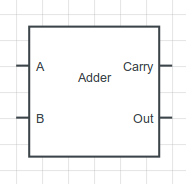
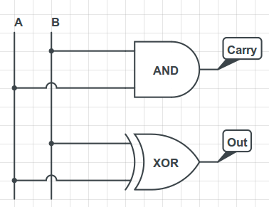
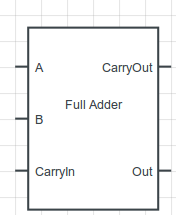
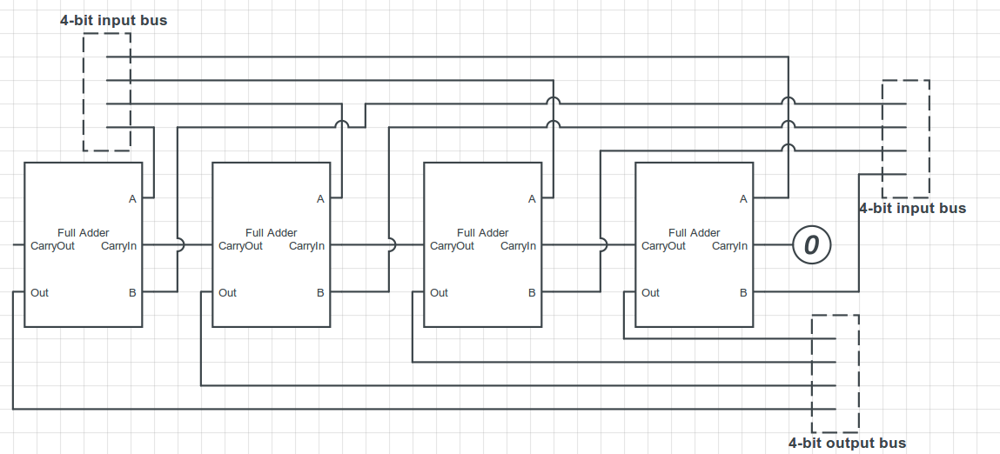

This is a continuation of [Computing with Transistors](http://andrew.gibiansky.com/blog/digital-design/computing-with-transistors/), a series of blog posts
describing how computers work from the ground up. The first post and namesake
of the series is available as Computing with Transistors. In this post, I use
Verilog to build arithmetic circuits, a language introduced in [Digital Design Tools: Verilog and HDLs](http://andrew.gibiansky.com/blog/digital-design/digital-design-tools-verilog-and-hdls).

At the most fundamental level, a computer is a device which can do some form of
computation. When computers were first being developed, they were mainly used
for mathematical computations; now, we use them for things such as media
consumption, communication, and art. But all of these are at the lowest
level just computations - arithmetic operations on values in memory. The
ability to do arithmetic is at the very core of computing.

In order to do any form of arithmetic, we first need to be able to represent
and store numbers. The simplest type of number is the integer, with values such
as 10, 15, 0, -12, and so on. As we discussed in The Digital State, computer
memory is just a series of bits: ones and zeros. So how can we encode any
arbitrary integer into a list of bits?

Two's Complement Notation
---

Although this seems like an almost trivial question, it turns out there are a
lot of different ways to do this. In grade school, we learn that we can
represent integers in different bases. When we write "12", what we mean is "1 *
10 + 2 * 1". When we write "153", we mean "1 * 100 + 5 * 10 + 3 * 1". But
there's nothing unique about base ten - we can write these same values in base
two. "10" becomes "1 * 2 + 0 = 2". Any integer from zero to 2^N - 1 can be
represented by a string of ones and zeros of length N.

There are some tricky aspects to this representation, though. How do we write
negative one, using a series of bits? It turns out this question has several
solutions!

The naive solution is to simply add a bit in front of the number to act as a
sign (a "sign bit"). If this bit is a zero, then the number is positive, but if
the bit is a one, then the number is negative. This is perfectly valid for some
cases, but it makes addition very difficult, because you must introduce special
hardware to deal with negative numbers.

The second solution, and the one commonly used in modern hardware, is known as
two's complement. Two's complement allows one to encode negative numbers with
something similar to a sign bit: the first bit of the number, if it is on,
contributes -2^(N-1) to the entire sum. Then, the remaining N-1 bits just form
a positive integer between 0 and 2^(N-1) - 1. So, if we have a 4-bit integer,
how can we write -3? Well, the first bit has to be negative, and is worth -2^3
(-8) to the sum. Then, the remaining 3 bits should form the number 5, so we set
them to 101. -8 + 5 = -3. Therefore, in two's complement notation with a 4-bit
number, -3 is encoded as 1101.

Suppose we have two numbers, 3 and -3, encoding both in 4-bit numbers using
two's complement notation. These are encoded as 0011 and 1101, respectively. If
we add them the way we normally add numbers, with no special considerations, we
find that we get 10000 - if we drop everything after the 4th bit, we get 0000.
This is the great thing about two's complement notation - by adding two N-bit
numbers, and discarding any bits after the Nth bit, we get the correct answer,
regardless of whether the numbers are positive or negative.

Adding Integers
---

Now that we know how to encode integers, how do we add them? Let's start with a
simple circuit, made for adding one-bit integers:




This circuit takes two 1-bit integers, adds them, and gives an output. It also
outputs a carry bit, indicating whether there was overflow. Constructing this
circuit is trivial: the carry bit is only on if both inputs are on, and the
output bit is on only if A xor B is true. We can realize this with the
following digital gates:



This is the first building block of a multi-bit adder, which is what we
ultimately want. We're going to need to propagate the carry through many
digits, though. In order to do this, we're going to build a circuit called a
full adder, which takes three bits and adds them. By convention, the third bit
is called the Carry-In bit, since it's usually the output of a Carry. The
schematic for a full adder is represented like this:



Building this is a bit more complicated than the previous 2-bit adder, but not
much more. The output will be on if an odd number of inputs are on. The carry
bit will be on if more than one of the inputs is on. A good exercise to test
whether you really understand this is to try creating a full adder using only
AND, OR, and NOT gates. If you're feeling adventurous, try to minimize the
number of gates you're using, or implement a full adder directly using MOSFET
transistors, as described in the first post, [Computing with Transistors](http://andrew.gibiansky.com/blog/digital-design/computing-with-transistors/).


Multi-Bit Adders
---

Full adders are great, but they only operate on one-bit numbers. What we want
is to add integers with many bits. It turns out that, as usual, there are many
ways to do this, and that these ways are a trade-off in speed and complexity.

The simplest method for adding multi-bit integers is a circuit called a
ripple-carry adder. A ripple-carry adder performs the same algorithm we
learned as children for adding integers. First, it adds the first two bits of
the number. Then, it adds the next two bits of the number, as well as the
carry from the previous addition. This is repeated until the entire number has
been added; the final carry bit is discarded. We can build this quite easily
using several full adder circuits. For example, here is a 4-bit ripple-carry
adder:




Why is this called a ripple-carry adder? The carry-bit starts out as zero, as
we can see from the schematic, because for the first digit there is no carry.
The adders compute a resulting output digit and a carry, and the carry is
propagated to the next adder. In this way, the carry bit ripples through the
entire adder chain. The first adder must be finished with its computation
before the next adder can begin, and the computation ripples through the
circuit sequentially.


What's wrong with a ripple-carry adder? In some sense, nothing. It functions
exactly as we want it to. However, it's slow: each adder must wait for all the
previous adders before it, so as we increase the number of digits in the
inputs, the time it takes for the electrical signals to propagate through the
entire circuit increases linearly with the number of digits. Each additional
digit adds one more adder, and an equal wait time. There are more advanced
adding algorithms which can reduce the time required (and shorten the
"criticial path" of the circuit), allowing CPUs to use a higher clock
frequency; I won't go into these more advanced adders, but a good one to start
with is known as the [carry-lookahead adder](http://en.wikipedia.org/wiki/Carry-lookahead_adder). 

Verilog
---

Luckily for us, if we use a higher-level design tool such as Verilog, we might
never actually have to deal with the details of two's complement notation and
adders. These things are so fundamental that they are built-in to Verilog (in a
sense); like in programming languages, Verilog allows you to write the sum of
two binary busses using a plus '+' operator, and it implicitly creates an adder
circuit in order to compute that sum. Similarly, Verilog assumes by default
that your internal representation is two's complement, so you do not have to do
anything.

With that said, let's look at a simple computational circuit to compute
Fibonacci  numbers quickly. This Fibonacci circuit will have a clock signal, a
reset signal, an input 6-bit integer, and an output 'ready' signal, and an
output 32-bit integer.

```verilog
module fib(input clock, reset, input [5:0] n, output ready, output [31:0] value)
// Computational circuit
endmodule
```

In order to use the Fibonacci circuit, we first have to pulse the 'reset'
signal. In order to compute Fibonacci numbers, the circuit will use three
internal registers to store its state. When the circuit is reset, it sets the
initial values on those registers to be the first two Fibonacci numbers, and
the index of the Fibonacci number that has been counted so far.

```verilog
module fib(input clock, reset, input [5:0] n, output ready, output [31:0] value)

reg [31:0] previous, current;
reg [5:0] counter;

always @(posedge reset)
    begin
        previous <= 32'd0;
        current <= 32'd1;
        counter <= 32'd1;
    end

endmodule
```

After pulsing the reset signal, we have to continually pulse the clock signal.
Once the circuit is done computing, it will set the 'ready' signal to high,
and we will know that it is done.

```verilog
module fib(input clock, reset, input [5:0] n, output reg ready, output [31:0] value)

reg [31:0] previous, current;
reg [5:0] counter;

// Reset the circuit
always @(posedge reset)
    begin
        previous <= 32'd0;
        current <= 32'd1;
        counter <= 32'd1;
    end

// Compute next Fibonacci number
always @(posedge clock)
    begin
        // Increment current index
        counter <= counter + 1;

        // Efficient adders are automatically inferred
        current <= current + previous;
        previous <= current;

       if (counter == n)
           ready <= 1;
    end

// Read the value of the nth fibonacci number from the internal register
assign value = current;

endmodule
```

This circuit can compute the $n$th Fibonacci number in $n$ clock cycles. You can
simulate this using a Verilog simulator such as *iverilog* to test the circuit,
or synthesize it onto an FPGA to experiment with it in hardware. The beautiful
thing about hardware - especially if you're coming from a software background
- is how incredibly fast it can be. In a thousand cycles we can compute the
1000th Fibonacci number: doing this in software, even in assembly language,
will take a much longer time. The more specialized your hardware, the faster
it can be;  this is why we can design circuits to take the Fourier transform
of a signal with incredible speed, while doing this on a conventional
general-purpose CPU can take quite a while. 
