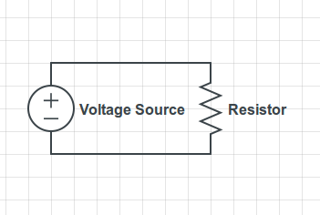
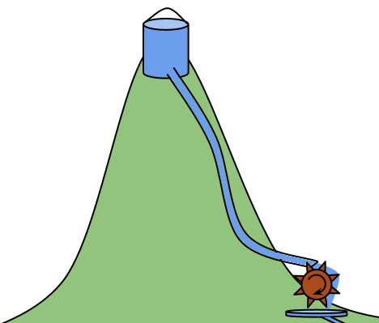
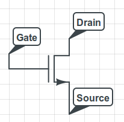
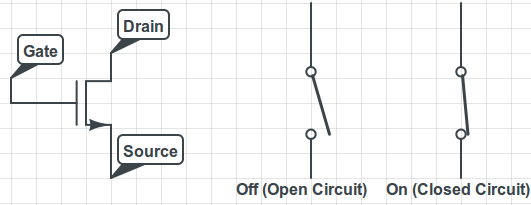
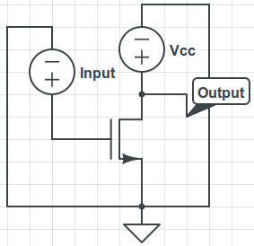
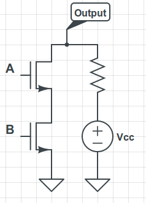
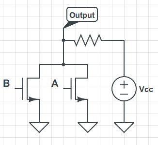

Computing with Transistors
--------------------------

> Any sufficiently advanced technology is indistinguishable from magic.
> - <cite>(Arthur C. Clarke)</cite>

For many years, I studied computers without ever understanding how they
work. On the inside, a computer is a monstrously complex beast, with layers
upon layers of abstraction which ultimately boil down to electrons running
through silicon, obeying the fundamental laws of physics. We've built up so
many layers of abstraction that the vast majority of people using computers
- even the vast majority of highly technical programmers - don't know (and
don't need to know!) how it all works on the inside. But while
understanding every single layer of abstraction to its fullest extent is
practically impossible, it's incredibly fascinating how modern computers
are built and what physical principles allow them to function.

In this series of blog posts, I'd like to introduce you to many of the layers
of abstraction bridging the gap between the laws of physics and assembly
language.  Given the rather large scope, I'm going to end up leaving out a lot
of information about every topic I discuss. Just note that every topic I
mention has, essentially, a field and a half solely devoted to it. With that
said, let's begin with circuits.

Circuits
--------

Fundamentally, all electronics operate on the basis of a set of equations known
as Maxwell's equations, which dictate how electric and magnetic fields
propagate. Particles known as electrons travel in the direction opposite the
electric field, creating a current of electrons. Different types of materials
have different effects upon electric fields and the movement of electrons, and
this allows us to conjoin different materials to create circuits. The first
important concept is that of a voltage source, or a battery. A voltage source
is an abstraction which simply allows us to dictate the electric potential at a
given point in the circuit, relative to some point in the circuit which we deem
at zero potential (called ground). When thinking of electric potentials and
currents, it can be very helpful to imagine an equivalent system but with a
gravitational field instead of an electric field. In that analogous system, a
voltage source is a hill with a bucket of water on it. The water has a lot of
potential energy - if we allow it out of the bucket, it will gain energy and
fall off the hill. Wires allow electrons to flow through them, towards higher
potential and away from lower potential - just like pipes allow water to flow
from higher regions to lower ones. As water flows from high to low, it can
encounter resistance which slows down the current, such as a water wheel. In
the same way, there is a circuit element called a resistor which prevents
electrons from flowing through wires quickly. With these two elements (a
voltage source and a resistor), we can draw a basic circuit:

Current flows from high potential (the plus sign) to low potential (the minus
sign).  As it flows through the resistor, energy is dissipated as heat into the
environment. Ohm's law says that the current is proportional to the voltage by
a factor of $1/R$, where $R$ is the resistance.                   

This electrical circuit is analogous to a very similar "gravitational circuit":

A "gravitational circuit" with a high potential (bucket of water on a
hill) and current flowing from a high potential to a low potential through some
resistance (in the form of a water wheel).

Mathematical analysis of circuits can be quite difficult, and there are many,
many different circuit elements which can behave in very non-linear and
confusing ways. However, the important thing is that you understand the
concepts of voltage and current flow. When we analyze a circuit, we declare
some point in that circuit to be our "ground" - in other words, its our
reference point, just like "sea level" is a reference point for height. When we
give the voltage at some point, we are always writing the potential energy with
respect to ground (in the same way that maps give height above sea level).
Current is the movement of electrons and goes from high voltage to low voltage,
like rivers flowing from mountains to the sea. Wires are just connections
between different places, and act like horizontal pipes for water, offering no
resistance to current and no change in voltage.

So, then, how can we use circuits to build a computer? We've still got a ways
to go.

The Transistor
--------------

Resistors simply dissipate energy as electrons flow through them. There are
other circuit elements called capacitors which can store charge as it flows
through them, and later discharge it. There are many other circuit elements,
but the one that all digital electronics are based off of is called the MOSFET
transistor. (There are other types of transistors, but they are rarely used in
digital electronics.)

(N-ch) MOSFET transistor with 3 ports: a gate, where the control signal is
applied; a drain, connected to a high potential; and a source, connected to a
lower potential. Counterintuitively, current actually flows from the drain to
the source, not the other way around. (However, electrons flow from the source
to the drain. Remember that current flows opposite the direction of electron
flow, since electrons are negative current!)

When operated as a digital element, the transistor can be modeled as a switch,
which acts like a wire or an open circuit (no connection), depending on whether
the switch is turned on. It has a control signal, which is applied as a voltage
at the gate, which turns the switch on or off. We then connect one end of the
transistor to a voltage supply (which can be thought of as an energy source)
and the other to ground (a place for the energy to go). When the voltage at the
gate is high, it allows current to flow through the transistor unhindered. When
the gate voltage is low, it acts like a broken wire and current cannot flow
through it.

Left: MOSFET circuit element; Center: transistor with low gate voltage acts
like an open circuit; Right: transistor with high voltage acts like a wire with
very low resistance.

The wonderful thing about transistors is that we can use them to perform
digital calculations on our input signal. Let's measure the voltage (as a
function of input voltage) on the side of the transistor that is farther away
from ground, like this:

Transistor with power at the drain with voltage Vcc and some input voltage
applied at the gate. We represent the ground point of the circuit with the
symbol at the source port of the transistor. Sometimes, circuit diagrams will
have multiple ground symbols - these are just shorthand to avoid drawing
grounding wires all over the diagram. The output is given by the voltage
measured at the point labeled "Output".

What happens if our input voltage is high? If the input voltage is high, then
the transistor happily allows current to pass, and just acts like a wire. Since
the transistor offers no (well, in really, very little) resistance, the voltage
we measure is low. What happens if our input voltage is low? In this case, the
transistor refuses to let current pass, so all the energy remains pent up away
from ground, and the voltage we measure is high. We just built a logic
inverter! It takes the logical value from our input signal and inverts it (high
becomes low, low becomes high). If we encode "0" bits as low voltage and "1"
bits as high voltage, we just built a one-bit binary NOT gate.

What else can we do? Turns out we can build AND gates and OR gates too. For
example, what does this circuit do?

We use voltages A and B as inputs, and measure the output as usual. Note that
there is a resistor here - while it wasn't included on the previous diagram, it
is absolutely necessary, otherwise we get a short-circuited ideal voltage
source, which is nonsensical. In this diagram and with our simplified model,
when A and B are both high, the entire voltage drop is over the resistor, which
prevents the current from being infinite.

The only way this will output a low voltage (a zero) is if both transistors act
like wires, which happens if both the input signals are one (high). This is a
NAND gate! Using a parallel connection instead of a serial connection, we can
build a NOR gate:

This time, we have two parallel transistors, and if either A or B are high,
then there is a path from Vcc to ground. If both are low, then there is no path
and thus no current, so the output voltage is high.

The only way this outputs a one (high voltage) is if both of the input voltages
are zero. If either input is high, the transistor becomes a short circuit, and
current can pass from the battery to ground. As an exercise, draw the diagrams
for AND and OR gates. (You can chain gates by connecting the output of one gate
to the input of another!)

(Note that this isn't actually the full story - in reality, there are two types
of MOSFETS which use differently doped semiconductors, called p-channel and
n-channel MOSFET transistors. Then, CMOS (complementary MOS) gates are built by
using both types of transistors, because some types are good for passing high
voltages and others are good for passing low voltages. Most microprocessors use
CMOS gates.)

In this way, transistors allow us to build logic gates. In addition to logic
gates, we can use transistors to build memory (RAM), registers, and many of the
other electrical components necessary to build modern digital systems.

We've now scaled two abstraction levels. The first one got us from the laws of
physics (Maxwell's equations, electric fields, and so on) to circuit diagrams
(voltage sources, resistors, and transistors). The second abstraction level
used transistors to get us from circuit diagrams to logic gates such as NOT
gates, AND gates, and OR gates. In the next post, we'll discuss some methods
for jumping the abstraction ladder from logic gates to stateful digital
circuits and numbers.
