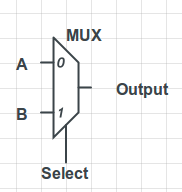

This is a continuation of [Computing with Transistors](http://andrew.gibiansky.com/blog/digital-design/computing-with-transistors/), a series of blog posts
describing how computers work from the ground up. The first post and namesake
of the series is available as Computing with Transistors. In this post, I build
off the concepts of logic gates and memory, which were introduced in the
previous post, [The Digital State](http://andrew.gibiansky.com/blog/digital-design/the-digital-state).

At the lowest level, digital circuits and processors are built out of
transistors - logic gates, memory arrays, flip-flops, and so on. Various
combinations of transistors, wires, capacitors, and so on can be assembled into
functional  units - individual components (gates, memory, etc) which do
something useful. But we're still miles and miles away from, say, a modern
Intel processor. Besides a lot of computer engineering knowledge, we're still
missing something major: Verilog.

Verilog
---

Verilog (like it's distant cousin, VHDL) is an incredibly powerful tool. It is
essentially a programming language for hardware. It allows you to write a
description of a piece of hardware, which can then be fed either to a simulator
or a synthesizer. The simulator allows hardware designers to test their digital
circuits before building them into circuits, and the synthesizer figures out
how the hardware description can be implemented in logic gates and transistors.
In programming language terms, the simulator is a Verilog interpreter, while
the synthesizer is a Verilog compiler. Verilog is what is known as a hardware
description language (HDL).

We're going to use Verilog in order to introduce a lot of basic digital
circuits, and eventually design our own processor. But we've still got a lot to
cover! Let's get started.

Multiplexers
---

As our first Verilog example, we're going to introduce an incredibly
fundamental digital logic element known as the multiplexer, or, more
affectionately, the mux. A mux has two k-bit input signals and a control signal
and outputs a single k-bit output signal. The control signal, also known as the
select signal, tells the mux which of the input signals to forward to the
ouput. For instance, if we have a mux with input signals A and B and a select
signal s, and s = 0, the output signal will be equal to the input signal **A**.
Conversely, if s = 1, the output will be equal to the input signal **B**.

Muxes look like this in circuit diagrams:



Let's make our multiplexer in Verilog. Circuit elements are defined as modules
in Verilog, with stated inputs and outputs. This module definition gives us the geometry of the multiplexer, as in the
circuit diagram shown previously. 

```verilog
module mux(input a, input b, input select, output out);
    assign out = select ? a : b;
endmodule
```

The code (saved in mux.v) describes exactly what this hardware does. If
'select' is ON, then connect 'a' to 'out, otherwise, connect 'b' to out. It
says nothing about how to do this, and that is left up to the synthesizer to
decide - the synthesizer can often do a better job than a person at
implementing logic with an optimal number of gates, transistors, or whatever
else you may want to optimize for.

In this short piece of code, there is a small pitfall which you might be
tempted to fall in to, especially if you are a programmer. Remember - Verilog
is a hardware *description* language. This 'assign' statement does not perform an
imperative assign. You cannot think of this as assigning "select ? a : b" to
the variable 'out'. Instead, this is a combinational logic circuit - the wire
named "out" is connected to the wires 'select', 'a', and 'b' through a circuit
which performs some operation on them. If a comparison between Verilog and
programming needs to be made, it would be more appropriate to compare the
'assign' statement to the 'let' statement in strict functional languages such
as OCaml and Haskell. Once something is 'assigned', it cannot be assigned
again.

Designing hardware is a difficult thing, so it's important to test it
rigorously. For part of that, we can use a Verilog simulator - you can find one
either in freely available FGPA software, such as Altera's Quartus suite, or
use the open source 'iverilog' simulator. In order to do a simulation, we
design a separate test-bench file:

```verilog
module mux_test;

reg a, b, s;
wire out;

mux my_mux(a, b, s, out);

initial begin
    a <= 0;
    b <= 1;
    s <= 0;
    #1;
    $display("In: %b, %b select %b. Out %b.", a, b, s, out);
    #1;
    s <= 1;
    #1;
    $display("In: %b, %b select %b. Out %b.", a, b, s, out);
    #1;
    a <= 1;
    b <= 0;
    #1;
    $display("In: %b, %b select %b. Out %b.", a, b, s, out);
end
endmodule
```

Let's go through this step-by-step.

```verilog
reg a, b, s;
wire out;
```

We use the 'reg' and 'wire' keywords to declare our "variables". 'a', 'b', and
's' are registers. This means that they are actually stored data, in some form
of memory - most likely something built out of D-flip flops, as discussed in
the [previous post](http://andrew.gibiansky.com/blog/digital-design/the-digital-state). 
On the other hand, 'out' is just a wire. It's just a node in our circuit
diagram, and giving it a name lets us connect things to it in order to use it
as an input or an output to various logic circuits. Since registers are
actually stored in memory, that means we can actually assign to them multiple
times and give them different values, while wires cannot be assigned to in the
same manner.

```verilog
mux my_mux(a, b, s, out); 
```

This line declares a subcomponent of our circuit. The subcomponent is taken
from the 'mux' module we defined earlier, and is called 'my\_mux'. It has
inputs and outputs defined in the same order as in the 'mux' module definition.
This is the Verilog equivalent of a function call! (But don't think of it as a
function call. Think of it as a C  "#include" or PHP "include()" statement,
which creates a circuit that we can use.) Note that we take registers (a, b, s)
as input, and our output is a wire (out). Reading from registers makes sense -
it's just connecting the output of the flip-flops to this circuit. Similarly,
using the 'out' wire as an output makes sense - we're just labeling the output
wire of our multiplexer as "out". Since we've already connected our multiplexer
to "out", we cannot connect anything else to "out" - that would mean that "out"
is assigned to two things, which makes no sense. Similarly, we cannot have a
register as an output; if 'out' was declared as a register, then we would get
an error, because  registers must be explicitly written to, and cannot just be
the destination of some signal from a combinational logic circuit.

```verilog
initial begin
    // Simulation code
end
```

This part is simple. 'initial' simply defines something that happens at the
beginning **of a simulation**. The 'begin'/'end' combination is just Verilog's
scoping method, equivalent to braces {} in C or Java or indentation levels in
Python. The code that goes inside the 'initial' statement can be thought of as
quasi-imperative commands. Note that the 'initial' statement is
non-synthesizable, which means that while we can use it in files meant for
simulation (such as test-benches) there is no way to realize this statement in
hardware. If you try to synthesize a file with an 'initial' statement, it will
either be ignored or give you an error.

```verilog
a <= 0;
b <= 1;
s <= 0; 
```

Let's give our registers some values. In Verilog, there are two types of
assignment. The first type of assignment, which we use here, is known as
*non-blocking assignment*, and uses the "<=" symbol. It's the non-blocking I/O
version of writing to a variable: the value will be written to that register,
but we're not sure when. The reason we have this in Verilog is because things
in circuits are inherently parallel. Everything we're doing is just defining
circuit elements and the wires connecting them, and voltages propagate through
a circuit in all paths of the circuit at once. The non-blocking assignment lets
us take advantage of that, and although it can make things much more difficult
to reason about, it makes our circuits much, much faster. If you *require* your
assignments to be sequential, Verilog also has blocking assignment via the "="
symbol: if you have several things using blocking assignment, you are
guaranteed that the blocking assignments that come earlier in your code will
actually happen before the blocking assignments that come later in your code.
Both blocking and non-blocking assignments are synthesizable, which means they
can be turned into real digital circuits.

```verilog
#1;
$display("In: %b, %b select %b. Out %b.", a, b, s, out);
#1; 
```

This is non-synthesizable simulator code. As you would guess, the \$display
command is the Verilog equivalent of "printf", and simply outputs values to
the standard output. The "%b" flag is used to output values as strings of
binary digits, which we often want to to when working with digital hardware.
Commands starting with a dollar sign '\$' are always commands to the
synthesizer or simulator, and cannot be synthesized.

It looks like a \$display is all we need - what are those funny hashes
littering the code around it? The '#1' command is a delay, and will wait for 1
unit of time. (Similarly, #n will wait for n units of time.) It turns out that
we need them! Earlier, we used non-blocking assignment, as in "a <= 0". If we
don't add some delay, the \$display statement might (and is likely to) get
executed in the simulator before the assignment actually happens. We need to
add a bit of delay to let the virtual signals propagate through our simulated
circuit, so that by the time we use a \$display statement, all the values and
voltages have settled to their correct locations.

Congratulations! You've now built and simulated your first HDL-based hardware
element. But we've got a lot to cover before we can turn this multiplexer into
a full-fledged microprocessor. But now we have Verilog, which is an amazing
tool and will make our lives much, much easier.

If you're interested in learning more about digital hardware design, I highly
suggest buying an FPGA and getting some experience by playing around with
different designs yourself. The [Altera Cyclone II Starter Kit](http://www.altera.com/products/devkits/altera/kit-cyc2-2C20N.html) is a great one
to start with, and includes a whole ton of onboard I/O ports (audio, VGA, SD
card) as well as some SRAM and SDRAM and one or two clocks. Their software
(the Quartus suite) works well on Windows and Linux.

Instead of letting this post drag on, I'm going to stop here for now. In the
next post, we'll finally get to some rather large designs. We'll build some
circuits to store and add integers, and go through a complete example of a
Fibonacci counter in Verilog. After the next post, we'll have covered enough
to start discussing how to design our own microprocessor.
