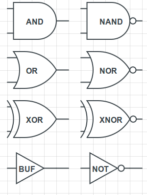
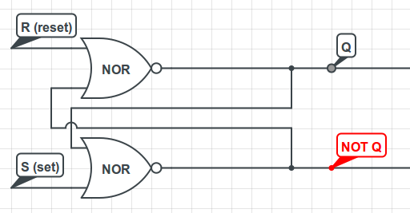
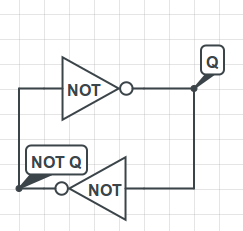
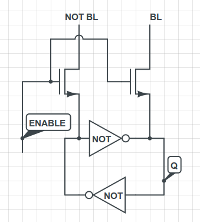

This is a continuation of Computing with Transistors, a series of blog posts
describing how computers work from the ground up. I build upon my description
of MOSFET transistors and logic gates from the previous post, [Computing with Transistors](http://andrew.gibiansky.com/blog/digital-design/computing-with-transistors/).

In the previous post, we discussed how we could use transistors to build logic
circuits, which could do simple boolean computations on their inputs. We can
extend this practice without much difficulty to compute arbitrarily complicated
boolean expressions. While this is great, on it's own, it's practically
useless. What are we missing?

Memory
---

In order to perform computation and execute long-running programs, we need some
form of storage. As it turns out, transistors are useful not only for logic,
but also for storing data in a digital state! There are many ways to use
transistors (sometimes with other elements, such as capacitors) to store
memory, but the fundamental idea behind many of them is that the dynamic system
that a network of transistors creates has a limited number of steady states in
which it can reside. If this doesn't make sense now, it will in a moment. Let's
go over a few different types of memory, and how we can build them out of
circuit elements.

Flip-Flops
---

Before delving into flip-flops, let's quickly go over logic gates.

Logic gates. These are the most common and basic one and two-input gates.

These eight gates are the most common and most useful logic gates, and it's
important to understand what each one does. In the previous blog post, we built
NOR and NAND gates, which are depicted and labeled above. The rest of the gates
are equally important, though:

- **AND**: An AND gate will output a "1" if and only if both of its inputs are "1".
The inputs are given on the two wires coming in to the flat side of the gate
(on the left), and the output is on the wire coming from the other side. It's
important that you think of these logic gate diagrams as "flows of logic", or
flows of truthiness, rather than circuits, because while they are instantiated
as digital circuits, current does not flow along the wires that are drawn going
in and out of the gates. The "1"s and "0"s are represented high low and high
voltages, as we discussed in the previous post.  
- **OR**: An OR gate will output a "1" if either of the inputs is a "1".  
- **XOR**: A XOR (pronounced "ex-or" or "zor")
gate will output a "1" if the two inputs are different from one another.  
- **NAND**, **NOR**, **XNOR**: These gates are simply inverses of the previous three. Take the
output of the previous three and negate it, and that's what these three will
output. Note that XNOR is sometimes also called EQUIV, because it will output a
"1" if and only if both of the inputs are the same (both are "0" or both are
"1").  
- **NOT**: A NOT gate takes its single input and outputs the opposite. If the
input is a 1, it'll output a 0; if the input is a 0, it'll output a 1.  
- **BUF**: A BUF gate is the logical complement of the NOT gate. It doesn't really do
anything logical (it simply outputs the input that it is given), but you will
occasionally find it in circuits because it can be used as a buffer. In other
words, you can stick it along a circuit path in order to preserve the same
voltage on both sides but to prevent current from flowing across the path.

Why are we going over gates, when we want to talk about memory? Well, a
flip-flop is a type of memory which can be built directly out of logic gates.
Here's what one type of flip-flop looks like: 

This is an SR flip flop. The S stands for "set" and the R stands for "reset".
Turning them on "sets" and "resets" the state of the flip flop, respectively.
We cannot turn both of them on.

What have we done? We've taken two NOR gates and fed the output of each one
into the other one. This is a pair of _cross-coupled_ NOR gates. Let's try to
figure out what this does!

Suppose we let R = 0 and S = 1. What happens? Well, regardless of what Q is in
the beginning, the output of the bottom gate must be "0". Thus, NOT Q = 0.
Then, the output of the top gate is NOR(0, 0), which is 1. Thus, Q = 1. We have
set the value inside the flip flop to be 1.

What if we let S drop down to 0? Well, nothing happens. If Q = 1 and R = S = 0,
then the output of the bottom gate will be NOR(1, 0) = 0, while the output of
the top gate will be NOR(0, 0) = 1. This is a stable configuration! The flip
flop remembers Q. If you repeat the same analysis for Q = 0 and R = S = 0,
you'll find that Q is remembered for Q = 0 as well.

Finally, if you let R = 1 and S = 0, you can trace the logic and you'll find
that Q must become 0. That's why R is called the reset signal - it resets the
value of Q to zero.

There's a pretty significant problem with this flip flop, though. We can't set
both R = 1 and S = 1. It's pretty clear that that assignment makes no sense,
though - what should the flip flop do if we try to set and reset it at the same
time? For that reason, these flipflops - called SR flip flops - are rarely used
in practice.

The most common type of flip flop used in practice is known as the D flip flop
(with D standing for "data"). The D flip flop has an "enable" signal and a
"data" signal. When the "enable" signal is on (high voltage, representing a
"1"), the flip flop stores whatever data is coming in via the data signal. When
the "enable" signal is turned off, the flip-flop simply remembers its state.
There are many variations on this, such as the edge-triggered flip flop, which
will only remember the state as the enable signal goes from low to high (and
only at that edge!). Edge-triggered flip-flops are used all over the place in
processor design, with the processor clock being the trigger that causes the
flip-flop to read data in.

Flip-flops are very fast, in the sense that it takes very little time for
signals to propagate all the way through a flip-flop. However, they're also
incredibly expensive - it can take five to six gates to build a single
flip-flop. With each gate taking 2-3 transistors, this can mean a total of
10-20 transistors for a single bit of memory. Not only is this expensive, but
it also means we can't fit a lot of flip-flops in a small area, which is a
requirement for having large memories. Due to these problems, flip-flops aren't
used for large amounts of memory, but they are very common for things like
internal processor registers and small register files.

SRAM
---

Flip-flops are great if you need to just store a few bytes of data, but
what if you want megabytes? Gigabytes? Well, for that, you need some sort of
RAM. One type of RAM is called SRAM, which stands for "static random access
memory". As you'll see, this fares significantly better than flip-flops on cost
- we can build a single bit of storage with only six transistors.  Let's start
by analyzing this "circuit":

The basic idea behind SRAM is that two coupled inverters will reinforce each
other and stay in whatever state they were originally put in.

This isn't a real circuit, but it serves to express the main point. Suppose Q =
0. Well, then NOT Q will obviously be 1. Which in turn means that Q will be 0.
And so on, and so forth. If we somehow set Q and NOT Q, these coupled inverters
will retain the same values of Q and NOT Q.

The real question is - how do we set the value of Q and NOT Q? Once we've done
that, we have ourselves a piece of one-bit memory. We're going to do this by
using two transistors to enable reading and writing from this memory cell, like
this: 

BL stands for "bit line". The enable signal is usually called WL, for
"word line". The word line usually enables a whole word of memory (for example,
32 bits). The bit line, however, is specific to that bit.

In order to write to this piece of memory, we set the ENABLE signal to be high
(to turn on both of those transistors) and then we set BL and NOT BL to the
appropriate values, connecting those wires either to ground (low voltage) or
Vdd (high voltage). These low and high voltages will override whatever state
the coupled inverters are currently in, thus writing that values into the bit
of memory.

In order to read from this piece of memory, we turn on the ENABLE signal, but
we don't drive the bit lines (BL and NOT BL) with any voltage - instead, we let
the inverters drive the bit lines. The inverters will set the value at the bit
lines to either 0 or 1, depending on the state of the inverter pair, and we can
use that value elsewhere in our circuit.

Wrap Up
----

There's quite a bit more to SRAM, though, that I won't go into. For
instance, how are we arranging these bits of memory into a large swath of
memory that we can access easily? We clearly can't wire every single bit of
memory to some external output - that would take far too many wires. The
circuitry that controls SRAM is also quite interesting, and I encourage you to
read more about it (on Wikipedia, or elsewhere). You'll often find SRAM as
embedded on-chip memory, or as processor caches. (I've been told that things
like monitors or printers will usually use SRAM to store their temporary data,
although I can't vouch for this, as I am an expert in neither monitors nor
printers.)

In fact, there's quite a bit more to other types of memory as well. There are
many more types of flip-flops, many of which are useful. There's another common
type of memory called SDRAM, which uses a capacitor for its storage element,
instead of coupled inverters. The great thing about SDRAM is that you can build
it with fewer transistors, and therefore can have higher volumes of memory for
lower costs. The price you pay is that you have to continually refresh the
contents of the RAM every few microseconds, because otherwise the voltage in
the capacitor slowly leaks away. SDRAM is usually more power-hungry than SRAM,
precisely due to this constant refreshing that has to happen. (By the way, the
DDR2/DDR3 RAM that you buy for your computer is SDRAM.)

Next Post
----

We've now talked about using transistors for computation and for
memory. We've set the stage for some much more interesting topics. We can now
use our fundamental units of hardware to build things such as multiplexers,
decoders, or numeric adders and multipliers. In the next post, I'll discuss
some of these basic hardware elements and number systems, which we're going to
use to build our own computer processor. I'll introduce Verilog, a language we
can use to describe hardware, so that we don't have to keep drawing incredibly
complicated circuit diagrams. There's some really awesome stuff coming up! 
